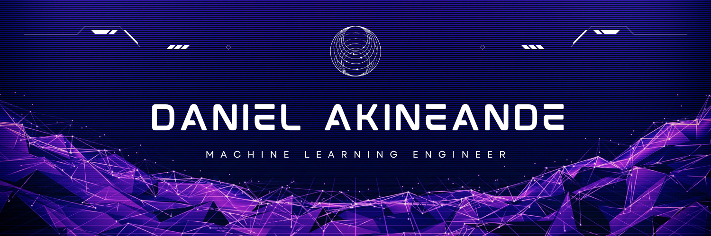

<!-- GitHub Profile README for: Daniel George Akinwande -->

<!-- Hero banner -->

  

<!-- Typing effect -->

  

---

## 🚀 About Me  

- 🎓 **First Class Computer Engineering Student (GPA: 4.57/5.0)** at *Olabisi Onabanjo University*  
- 🔬 Research interests: Predictive Modeling • Computer Vision • Agentic AI • Applied ML  
- 💡 Skilled in Python, C++, Java, TensorFlow, scikit-learn, and more  
- 🏆 Awards: *Best Graduating Student (Comp. Engr.)* • *Outstanding Scholar Award (2022/23)*  
- 💼 Experience: API Development • ML Pipelines • Data Analytics • Embedded Systems  
- 📫 Reach me: **danielakinwande00@gmail.com**  

---

## 🛠️ Skills  

  

---

## 📌 Featured Projects  

### 🔥 AI & Machine Learning
<table>
<tr>
<td width="50%" valign="top">

### <a href="https://github.com/Danakin01/drowsiness_detection">Drowsiness Detection</a>
Real-time drowsiness detection using OpenCV and facial landmarks.  
 

</td>
<td width="50%" valign="top">

### <a href="https://github.com/Danakin01/email_classifier">Email Classifier</a>
ML-based email spam classifier — feature extraction + embeddings (Precision > 95%).  
 

</td>
</tr>
</table>

### 📊 Prediction & Analytics
<table>
<tr>
<td width="50%" valign="top">

### <a href="https://github.com/onafuye12/Student-Performance-Prediction-DFA24">Student Performance Prediction</a>
Predicting student outcomes with ML models.  
 

</td>
<td width="50%" valign="top">

### <a href="https://github.com/Danakin01/bike_rental_demand_prediction">Bike Rental Demand Prediction</a>
Forecasting bike rentals with regression models.  
 

</td>
</tr>

<tr>
<td width="50%" valign="top">

### <a href="https://github.com/Danakin01/rent-predict-lagos">Rent Predict Lagos</a>
Rental price prediction for Lagos neighbourhoods — feature engineering + model explainability.  
 

</td>
<td width="50%" valign="top">

### <a href="https://github.com/Danakin01/Intelligent-Rental-Price-Prediction-model">Intelligent Rental Price Prediction</a>
End-to-end ML pipeline for rental price estimation and evaluation.  
 

</td>
</tr>
</table>

### 📚 Academic & Research Tools
<table>
<tr>
<td width="50%" valign="top">

### <a href="https://github.com/Danakin01/FRP-strengthened-RC-beams-database-and-GUI">FRP RC Beams DB & GUI</a>
Database + GUI for FRP-strengthened reinforced-concrete beams — used in structural ML research.  
 

</td>
<td width="50%" valign="top">

### <a href="https://github.com/Danakin01/AI-Powered-Database-Query-Chatbot">AI-Powered Database Query Chatbot</a>
Natural-language interface to query databases (prototype).  
 

</td>
</tr>
</table>

---

## 📈 GitHub Stats  

  
  

---

## 🏅 GitHub Trophies  

  

---

## 📊 Contribution Graph  

  

---

## 🌍 Connect With Me  

  
  
  

---

⭐️ Crafted with passion by <b>DANAKIN</b>

